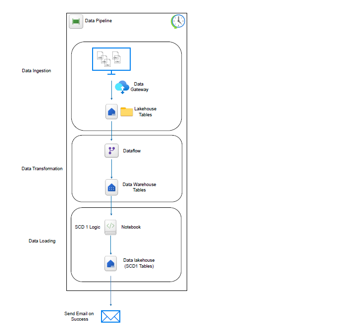

# Project 4: Fabric Data Pipeline
## Task 1: Incremental Data Loading, SCDType1 and Notifications
## Task 2: Sales Data Modeling and Reporting Pipeline using Microsoft Fabric

📌 Overview

In today’s data-driven world, businesses must efficiently ingest and transform large volumes of structured data while ensuring reliability and transparency in the pipeline. This project solves the challenge of loading on-premises data incrementally into Microsoft Fabric, transforming it for analytics, and sending automated notifications upon successful refresh.

---
### ETL Workflow

---
### 🛠️ Technologies Used

- Microsoft Fabric 
- Fabric Lakehouse & Warehouse 
- Dataflow Gen 1 
- Fabric Notebooks 
- On-Premises Data Gateway 
- Outlook Email Notification Task 
- Power BI 
- Draw.io

---

### 🧩 Project Steps

## Task 1: Incremental Data Loading, SCDType1 and Notifications

###### Steps: On-Premises Data Ingestion
- Connect to source using On-Prem Gateway.
- Load into Fabric Lakehouse.
- Perform SCD Type 1 using Fabric Notebooks.
- Load to separate lakehouse tables and notify via email on success.

## Task 2: Sales Data Modeling and Reporting Pipeline using Microsoft Fabric

###### Step 1: Sales Data from ADLS Gen2
- Transform Excel sales file (deduplication, type casting, null filtering).
- Load into Lakehouse as dimension tables.

###### Step 2: Sales Return Data

- Clean and transform return Excel file.
- Create a junk dimension for return flag (Yes/No).
- Store as a dimension table in Lakehouse.

###### Step 3: Fact Table and Reporting

- Join all dimension tables to create a normalized fact_sales table.
- Display enriched records via SQL view.
- Connect Power BI to the view for interactive dashboards.

---
#### Deliverables: 

- Configured and documented data pipelines 
- Notebook-based transformation and SCD logic 
- Architecture diagram 
- Power BI dashboards with visuals 
- GitHub repository with code and documentation

  
---

Connect with me on my profile below for more updates:

LinkedIn: https://www.linkedin.com/in/harpalvaghela/

Website: https://www.harpalvaghela.com

Medium Blog: https://medium.com/@harpalvaghela

Thank you
